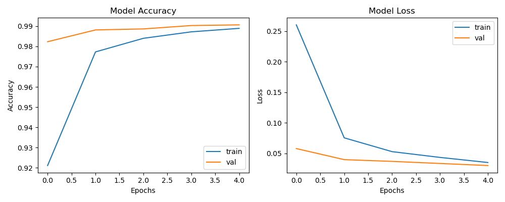
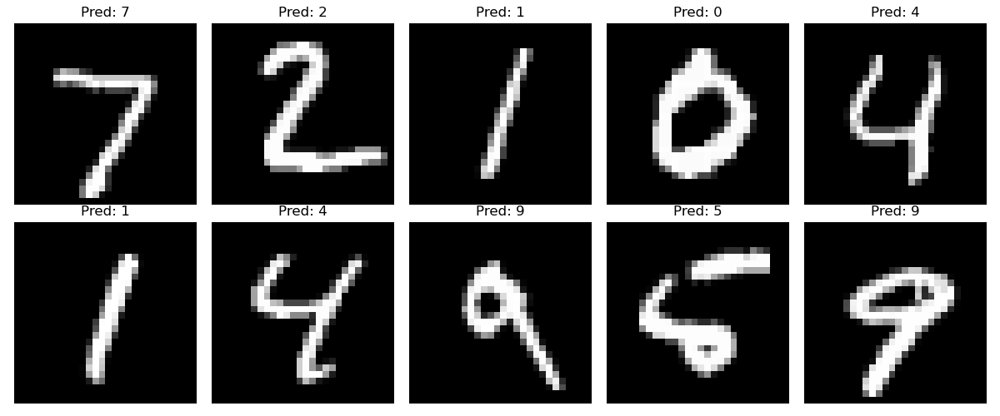

# 🧠 Handwritten Digit Recognition with CNN (MNIST)

This project builds and trains a **Convolutional Neural Network (CNN)** using the **MNIST dataset** to classify handwritten digits (0–9).

## 📁 Project Structure

digit-recognition-cnn/
├── models/
├── notebooks/
├── images/
├── README.md
└── requirements.txt


## 📊 Dataset

- Source: [MNIST](http://yann.lecun.com/exdb/mnist/)
- 60,000 training images and 10,000 test images
- Each image: 28x28 pixels grayscale

## 🏗️ Model Architecture

- Conv2D → MaxPooling
- Conv2D → MaxPooling
- Flatten → Dense → Dropout
- Dense (Softmax for 10 classes)

## ✅ Results

- **Test Accuracy**: ~98%
- Accuracy & Loss Curves:



## 🎯 Sample Predictions



## 🚀 How to Run

```bash
pip install -r requirements.txt
